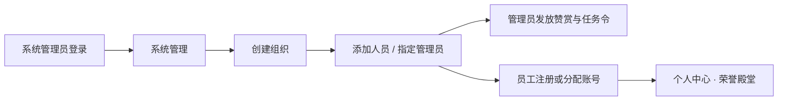
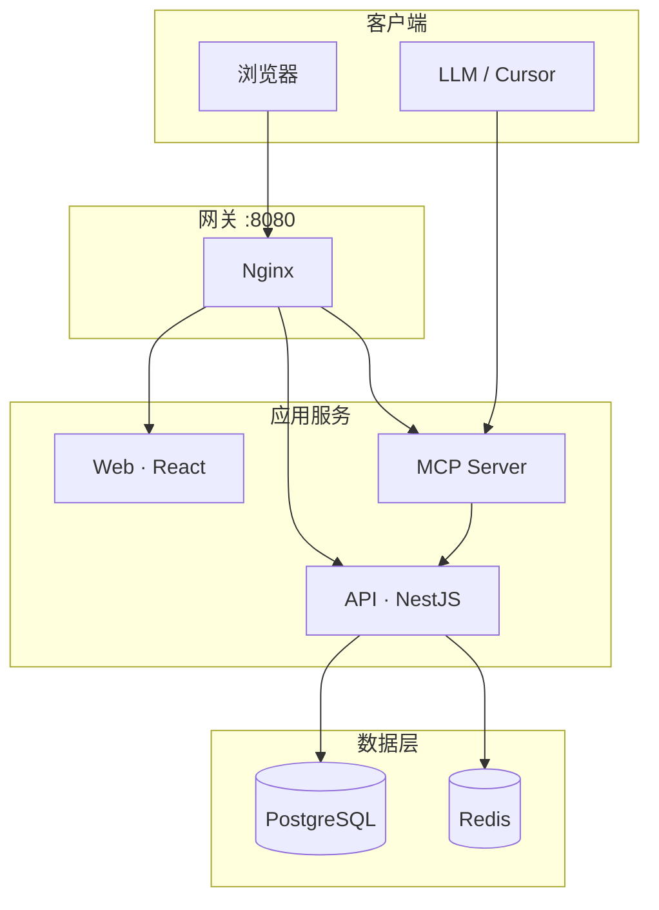

<p align="center">
  
</p>

<p align="center">
  <strong>企业荣誉激励与展示系统</strong><br/>
  <sub>让成就被看见 · 让协作被记录 · 让激励有仪式感</sub>
</p>

<p align="center">
  <a href="#-快速开始">快速开始</a> ·
  <a href="#-核心能力">核心能力</a> ·
  <a href="#-系统架构">架构</a> ·
  <a href="#-mcp-与大模型">MCP</a> ·
  <a href="docs/需求设计书.md">需求文档</a>
</p>

---

## 简介

**荣耀之窗（WindowOFHonor）** 是一套面向企业团队的荣誉激励与展示平台。主管可发放赞赏与任务令，员工可在个人中心查看荣誉、拍档与任务进展，荣誉殿堂与排行榜则让成就在大屏与日常浏览中持续可见。

系统采用 **Docker Compose 一键部署**，支持内网私有化；同时提供 **MCP 接口**，可与 Cursor 等大模型工具无缝集成。

> 业务系统默认**不含演示数据**。首次部署仅创建系统管理员，组织与人员由你在「系统管理」中维护。

---

## 核心能力

<p align="center">
  
</p>

| 模块 | 说明 |
|------|------|
| **激励发放** | 主管向员工（或共获）发放赞赏，形成可追溯荣誉记录 |
| **任务令** | 分配任务、跟踪状态；截止前/后分阶段流转（进行中 ↔ 已完成 / 已逾期 ↔ 已完成） |
| **个人中心** | 个人 / 团队双 Tab：我的赞赏、任务令、最佳拍档、历史记录 |
| **荣誉殿堂** | 全屏展播 + 个人 / 团队排行榜 |
| **系统管理** | 组织、人员、管理员配置（超级管理员） |
| **MCP 接入** | 大模型可代为发放激励、查询荣誉与任务令 |

---

## 快速开始

### 环境要求

- Docker Engine 20+ 与 Docker Compose V2
- 可用端口：`8080`（Web/API 网关）、`3100`（MCP，可选外曝）

### 三步上线

```bash
# ① 克隆并配置
git clone git@github.com:QkHearn/WindowOFHonor.git
cd WindowOFHonor
cp .env.example .env
# 编辑 .env：至少修改 POSTGRES_PASSWORD、JWT_SECRET、SEED_SUPERADMIN_PASSWORD

# ② 构建并启动
docker compose up -d --build

# ③ 初始化系统管理员（仅首次、数据库为空时执行）
set -a && source .env && set +a
docker compose exec -T \
  -e SEED_SUPERADMIN_USERNAME \
  -e SEED_SUPERADMIN_PASSWORD \
  -e SEED_SUPERADMIN_DISPLAY_NAME \
  api npx prisma db seed
```

### 访问地址

| 服务 | 地址 |
|------|------|
| Web 前台 | http://localhost:8080 |
| API 健康检查 | http://localhost:8080/api/health |
| MCP（直连） | http://localhost:3100/mcp |

### 首次登录

| 配置项 | 说明 | 默认 |
|--------|------|------|
| `SEED_SUPERADMIN_USERNAME` | 登录用户名 | `superadmin` |
| `SEED_SUPERADMIN_PASSWORD` | 登录密码（**必填**） | — |
| `SEED_SUPERADMIN_DISPLAY_NAME` | 显示名称 | `系统管理员` |

登录后的推荐路径：



| 角色 | 典型操作 |
|------|----------|
| 系统管理员 | 组织 / 人员 / 管理员管理 |
| 管理员（主管） | 发放赞赏、发放任务令、查看团队数据 |
| 员工 | 个人中心、排行榜、荣誉殿堂、点赞 |

---

## 系统架构

<p align="center">
  
</p>



### 技术栈

| 层级 | 技术 |
|------|------|
| 前端 | React 19 · Vite · Tailwind CSS · Framer Motion |
| API | NestJS · Prisma · PostgreSQL |
| AI 接入 | MCP SDK（Streamable HTTP） |
| 部署 | Docker Compose · Nginx |

---

## 本地开发

适合二次开发或调试，仅需 Docker 提供数据库：

```bash
# 启动 PostgreSQL + Redis
docker compose up -d postgres redis

# API
cd apps/api
npm install
npx prisma migrate dev
SEED_SUPERADMIN_PASSWORD=dev_password npm run prisma:seed
npm run dev          # → http://localhost:3000

# Web（新终端）
cd apps/web
npm install
npm run dev          # → http://localhost:5173

# MCP（可选，新终端）
cd apps/mcp
npm install
npm run dev          # → http://localhost:3100
```

---

## 生产部署

### 单独构建镜像

```bash
docker build -t windowofhonor-api:1.0.0 ./apps/api
docker build -t windowofhonor-web:1.0.0 ./apps/web
docker build -t windowofhonor-mcp:1.0.0 ./apps/mcp
```

### 离线部署包

```bash
bash scripts/package-images.sh 1.0.0
# 生成 dist/windowofhonor-1.0.0.tar.gz
```

解压后按平台执行一键脚本（自动读取 `.env` 并完成 seed）：

| 平台 | 命令 |
|------|------|
| Linux | `./deploy-linux.sh` |
| macOS | `./deploy-macos.sh` |
| Windows | `deploy-windows.bat` 或 `powershell -ExecutionPolicy Bypass -File deploy-windows.ps1` |

---

## MCP 与大模型

将 [`docs/mcp-cursor-config.example.json`](docs/mcp-cursor-config.example.json) 合并到 Cursor MCP 设置，并替换 `MCP_API_KEY`。

<details>
<summary><strong>可用工具一览（点击展开）</strong></summary>

| 工具 | 说明 |
|------|------|
| `honor_issue_incentive` | 发放激励 |
| `honor_get_broadcast` | 荣誉展播 |
| `honor_get_leaderboard` | 个人 / 团队排行榜 |
| `honor_get_user_honors` | 用户荣誉 |
| `honor_get_partners` | 最佳拍档与关系网络 |
| `honor_get_tasks` | 任务令 |
| `honor_like_user` | 点赞 |
| `honor_search_users` | 搜索员工 |
| `command_query_all_honors` | 【外部】全部荣誉 |
| `command_query_all_tasks` | 【外部】全部任务令 |
| `command_query_latest_honor` | 【外部】最新荣誉 |
| `command_query_latest_task` | 【外部】最新任务令 |
| `command_query_today` | 【外部】今日新增 |

外部查询 API（需 `X-Service-Token`）：`GET /api/queries/honors` · `/tasks` · `/honors/latest` · `/tasks/latest` · `/today`

</details>

**stdio 模式（本地调试）：**

```bash
cd apps/mcp
MCP_TRANSPORT=stdio \
MCP_SERVICE_TOKEN=your_token \
API_BASE_URL=http://localhost:3000 \
npm run start:stdio
```

---

## 测试

详见 [docs/测试说明.md](docs/测试说明.md)。

```bash
# 全量测试
npm test

# 部署后冒烟（需先 seed 并配置 SEED_SUPERADMIN_PASSWORD）
docker compose up -d --build
set -a && source .env && set +a && npm run test:smoke
```

| 命令 | 说明 |
|------|------|
| `cd apps/api && npm run test:unit` | API 单元测试 |
| `cd apps/api && npm run test:e2e` | API 集成测试 |
| `cd apps/mcp && npm test` | MCP 测试 |
| `cd apps/web && npm test` | 前端组件测试 |

---

## 文档

| 文档 | 说明 |
|------|------|
| [需求设计书](docs/需求设计书.md) | 功能范围与权限矩阵 |
| [技术架构选型](docs/技术架构选型.md) | 架构决策记录 |
| [UI 奢侈品风格提示词](docs/UI奢侈品风格提示词.md) | 视觉设计规范 |
| [MCP 配置示例](docs/mcp-cursor-config.example.json) | Cursor 接入模板 |

---

## 项目结构

```
WindowOFHonor/
├── apps/
│   ├── api/          # NestJS 后端
│   ├── web/          # React 前端
│   └── mcp/          # MCP 服务
├── docker/           # Nginx 等配置
├── docs/             # 设计文档与 README 配图
├── scripts/          # 部署、打包、冒烟测试
├── docker-compose.yml
└── .env.example
```

---

<p align="center">
  <sub>WindowOFHonor · Private / Internal Use</sub>
</p>
